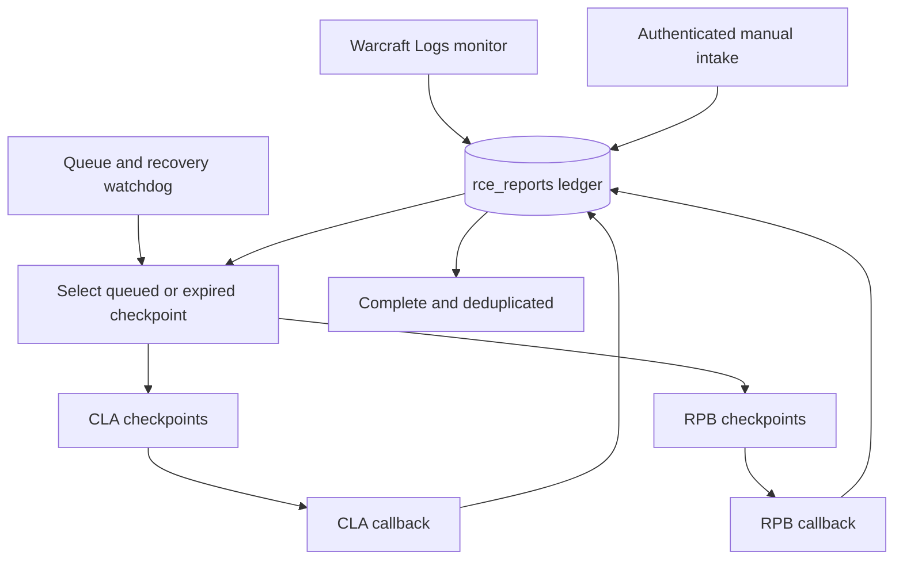

# Automation Architecture

## Overview

All discovery and manual submission paths feed one n8n workflow and one `rce_reports` ledger. The queue coordinator chooses at most one active report and advances exactly one checkpoint at a time.



The workflow intentionally contains multiple trigger rows. They are separate entry points into the same coordinator, not separate report-processing systems.

## Trigger Paths

| Trigger | Default | Responsibility |
|---|---:|---|
| Queue and recovery watchdog | Every minute | Select queued work or retry an expired checkpoint lease. |
| Warcraft Logs monitor | Every five minutes | Discover reports and classify live, stabilizing, eligible, or completed work. |
| Authenticated intake webhook | On request | Queue a valid 16-character report code or return its existing state. |
| CLA callback | On Apps Script completion | Verify correlation and stage, then advance the ledger. |
| RPB callback | On Apps Script completion | Verify correlation and stage, then advance or complete the ledger. |

## Live-Log Detection

The monitor requests up to 100 guild reports from the previous seven days through the Warcraft Logs v2 client API. It calculates fight count, total combat duration, report timestamps, whether the end timestamp changed between scans, and when changes were last observed.

A report needs at least one fight and 60 seconds of combat data. A newly discovered completed upload can queue immediately when it does not appear live. A report observed changing remains live or stabilizing until either:

- no event-timestamp change is observed for 15 minutes; or
- four hours have elapsed since it was first observed.

These values are embedded in the classifier Code node and can be adjusted after import.

## Checkpoint State Machine

```text
DISCOVERED / LIVE / STABILIZING
  -> QUEUED
  -> CLA_RUNNING: CLA_GEAR_ISSUES
  -> CLA_GEAR_LISTING
  -> CLA_CONSUMABLES
  -> CLA_DRUMS
  -> CLA_SHADOW_RESISTANCE
  -> CLA_EXPORT
  -> RPB_RUNNING: RPB_ALL_DATA
  -> RPB_EXPORT_ROLES
  -> COMPLETE
```

Before dispatch, n8n records the stage, correlation ID, heartbeat, attempt counters, and lease expiry. A matching callback advances the stage. Duplicate, stale, and out-of-order callbacks are ignored.

## Recovery

Each dispatched checkpoint receives a ten-minute lease. If no valid callback updates the row before expiry, the watchdog retries only that checkpoint. Completed checkpoints are not replayed.

Apps Script also maintains a per-document lock. Repeating `setReportId` for the same report resumes the existing lock; a different report receives a busy response until the lock expires or is released.

## Serialization Boundary

The ledger and active-state guard are the shared serialization mechanism for CLA and RPB. Do not activate legacy monitor, intake, or queue workflows that write to the same sheets or ledger.

The current Data Table selection/update sequence is not a transactional compare-and-set lock. Deployments that can run multiple watchdog executions concurrently should add an atomic external lock or single-consumer execution lane as a future hardening step.
